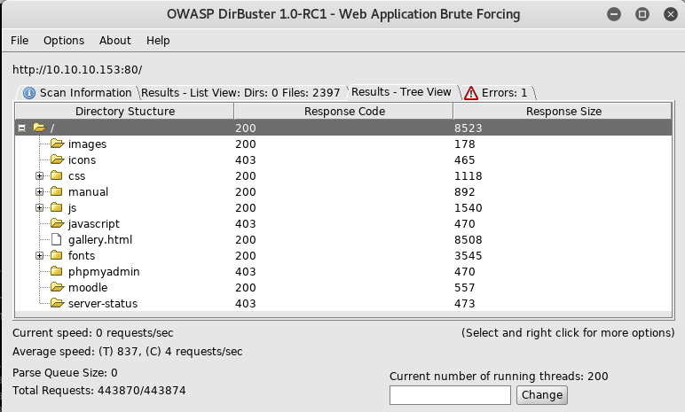
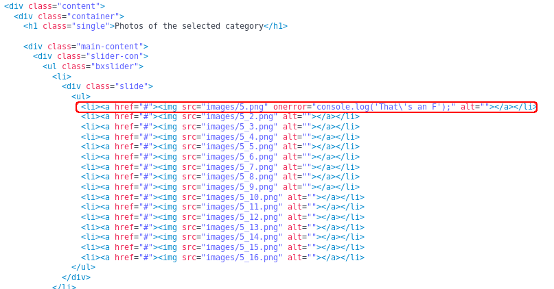
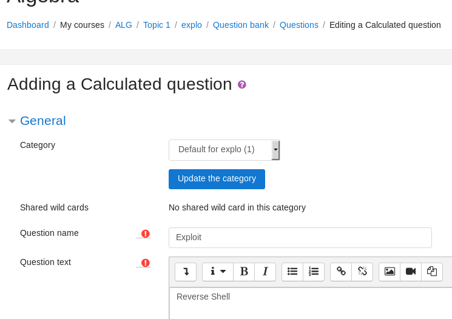
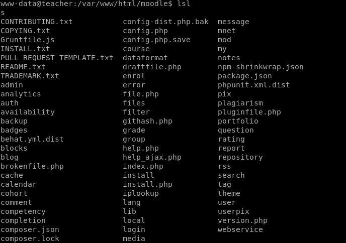
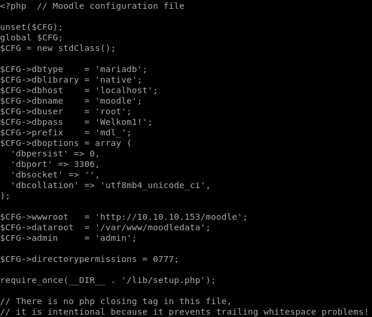
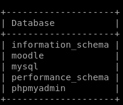
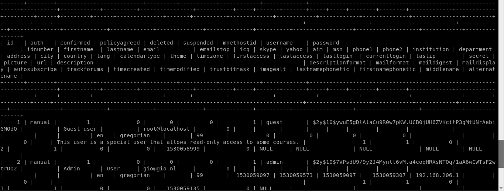
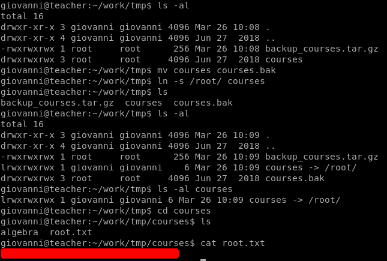

# TEACHER
## Info

IP Address: 10.10.10.153  
OS: Linux  
Difficulty: Easy/Medium  

## System Enumeration

### NMAP
Using `nmap`, we check for open ports to access  


Only `Port 80` is up.

### Dirbuster
To enumerate the website we use, `dirbuster`  


### Website


Just browsing the website we see a peculiar snippet of code on the `gallery.html` page  


Checking the console we find what we expected  


To properly check everything on the website I decided to download the entire website to my local machine using `wget --mirror`  


The above output in console tells me that there's something peculiar about `5.png`, let's check it out  


#### Moodle


Seems like, this would be our way in. A quick google search `moodle exploit` shows the existence of an `Evil Teacher` exploit  
`https://blog.ripstech.com/2018/moodle-remote-code-execution/`

But it needs us to login to the service as a teacher.

### Using Hydra

From 5.png we have found 14/15 characters for the password  
`Th4C00lTheacha`  
To guess the last character for the password, we will use hydra  
I created a wordlist with a list of all characters and used that for hydra input  
```
hydra -l giovanni -P wordlist.txt 10.10.10.153 http-post-form "/moodle/login/index.php:username=^USER^&password=Th4C00lTheacha^PASS^:Invalid login, please try again" -Vv
```
We found the password and logged in to moodle

### Remote Code Execution

Step 1: Create a quiz.  
Step 2: Add a calculated question.
	  
Step 3: Add the formula given to the answer.
	  
Step 4: Use the RCE to obtain a reverse shell.  
	I used the netcat reverse shell, simply append the code like so

	```
	&0=(<your code here>)
	```


## User Elevation

Using `ps aux` we find that we have a MySQL service running in the system.  


Enumerating the current directory  


Let's checkout `config.php`  


As we can see, the credentials are given in plaintext, so we can login

### MariaDB

Logging into the service using `mysql -u root -p` and using the password we obtained  


Checking the databases we can operate with using `show databases;`  


The database `moodle` seems like a nice place to start, `use moodle` to access moodle  
Using `show tables` to see all tables in this database, we find the table `user`  
Since config.php stated that the prefix used is `mdl_`, we will work accordingly.  
`select * from mdl_user` gives us  


Let's try to make it readable using `select id,auth,username,password from mdl_user;`  


Cracking the hash we see for `Giovannibak` we get a password, hopefully giovanni hasn't changed the password and it's the same as the backup.  

### Logging as Giovanni

Using `su -- giovanni` we try to elevate from `www` to `giovanni`  


## User Gained


## Going for Root

In our current working directory we see a work folder, in which there's a tmp folder.  

In this directory the `courses` from the work folder are being backed up.  
So to get `root.txt`, we attempt to create a symlink to the `/root/` directory.  

